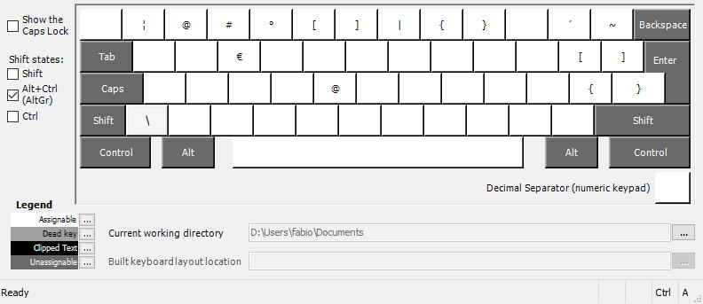

# Swiss Developer Keyboard Layout
For of a project by [Sirius-A](https://github.com/Sirius-A/swiss-german-developer-keyboard-layout), I simply added a swiss-french layout option.
A slightly modified keyboard layout for swiss programmers. The layout is
inspired by the [Magerman's Swiss Developer Keyboard](https://www.magerman.com/en/Keyboard.html).

With this approach no hardware is required. All you need to do is install your 
preferred layout and you are good to go.

## Differences to the default layout

The two most notable changes are:

- Option for no dead keys (recommended)
- Easier access to `[ ]` via `AltGr + 6,7` and `{ }` `AltGr + 8,9`

The full layout can be seen in the pictures below.

**Base**  


**AltGr / Ctrl + Shift**  


**Ctrl**  


**Shift**  


## What Does "No Dead Keys" Mean?

[Dead Keys](https://www.wikiwand.com/en/Dead_key) refer to the modifier keys like <kbd>\`</kbd>
and  <kbd>~</kbd>, that by default wait for another letter to be pressed. With a `nodeadkeys`
layout, the symbols will be instered imediately after pressing it.

## Setup

**Windows**  
Download the layout (folder) you like and execute the `setup.exe`. After a restart,
the layout should work fine. The `setup.exe` can also be used to remove the
layout again.

**Linux**  
The remapping is done via `xkb`, which should work for any desktop environment
for Xorg as well as Wayland. (Note: the swiss french layout is not yet available for linux)

``` sh
# Copy the layout files to $XDG_CONFIG_HOME/xkb
cp -r linux/xkb ~/.config/

# Apply the changes 
# Note: the warning about additional symbols that could not be mapped can be ignored
xkbcomp -I$HOME/.config/xkb $HOME/.config/xkb/keymap-chpn.txt $DISPLAY

# If the layout works: Add the line above in your .profile or .xsessionrc

# In theory this should apply it as well, but doesn't for me :(
setxkbmap -layout ch -variant de_nodeadkeys -option chpn:chprogletters
```

## Generate your own

The windows keyboard layouts were generated with the
[Microsoft Keyboard Layout Creator (MSKLC)](https://www.microsoft.com/en-us/download/details.aspx?id=102134).

The `klc` files can be used to modify and generate your own layouts.
